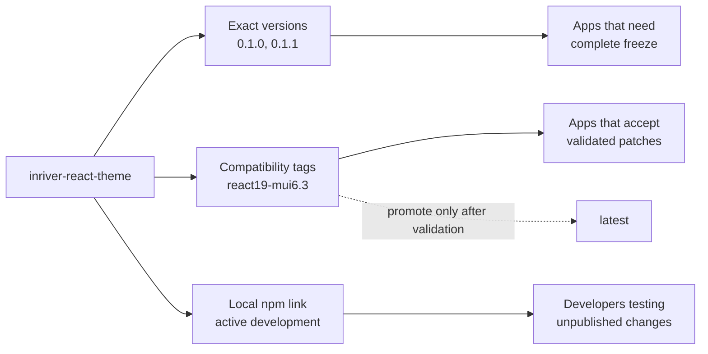
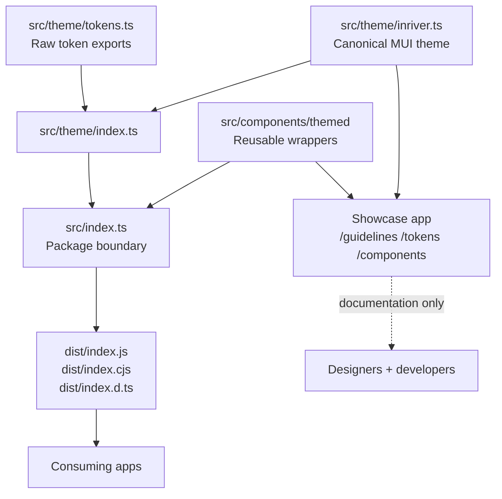

# Inriver React Theme

Internal React/MUI theme package and live showcase for Inriver product UIs.

The goal of this repository is not to force every app onto the newest design work immediately. It gives teams a shared theme contract, versioned compatibility checkpoints, and a local development workflow so theme changes can be tested before they become a dependency for other apps.

## What this repo owns

- **Canonical MUI theme** in `src/theme/inriver.ts`.
- **Design token exports** in `src/theme/tokens.ts` for custom surfaces that cannot use MUI directly.
- **Small themed wrapper layer** in `src/components/themed/` for common Inriver-styled components.
- **Live showcase** under `src/pages`, `src/showcase`, and `src/app` for design review and developer examples.
- **Library build** from `src/index.ts` to `dist/index.js`, `dist/index.cjs`, and `dist/index.d.ts`.

Consuming apps should import from the package root only:

```ts
import { inriverTheme, ThemedButton, inriverTokens } from 'inriver-react-theme';
```

Do not import showcase pages, demo components, or internal source paths from consuming apps. Those are documentation/demo code, not the stable package surface.

## Why versioning matters

Theme packages can fragment product UI in two opposite ways:

1. **Every app drifts locally** because teams copy tokens and patch one-off styles.
2. **Every app is hard-locked to bleeding edge** because one moving package changes under them.

This repo avoids both by separating **immutable versions** from **moving compatibility tags**.



| Mechanism | Example | Purpose |
| --- | --- | --- |
| Exact package version | `inriver-react-theme@0.1.0` | Immutable artifact. Use when an app wants no movement. |
| Compatibility checkpoint tag | `inriver-react-theme@react19-mui6.3` | Moving channel for the same React/MUI contract. Patch fixes can move here after validation. |
| Source recovery tag | `theme/react19-mui6.3/v0.1.0` | Immutable Git anchor for audit, rollback, and security review. |
| `latest` | `inriver-react-theme@latest` | Only promoted after teams intentionally adopt and verify a checkpoint. Never publish directly to it. |

The publish guard in `scripts/guard-publish.cjs` enforces this: releases must use an approved checkpoint tag such as `react19-mui6.3`, and direct publishing to `latest` is blocked.

For production apps that want safe patches but not new checkpoints, prefer a patch range such as:

```json
{
  "dependencies": {
    "inriver-react-theme": "~0.1.0"
  }
}
```

Use an exact version for critical apps that need complete freeze. Use a compatibility tag when the app team accepts automatic patch movement inside that React/MUI baseline.

See [`docs/VERSIONING.md`](docs/VERSIONING.md) for the full release and adoption model.

## Architecture at a glance



```text
inriver-react-theme/
├── src/
│   ├── index.ts                  # Public package entry: theme + themed components only
│   ├── theme/
│   │   ├── inriver.ts            # Canonical MUI createTheme source
│   │   ├── tokens.ts             # Raw design tokens for custom surfaces
│   │   ├── default.ts            # Vanilla MUI comparison theme
│   │   └── index.ts              # Theme barrel exports
│   ├── components/themed/        # Public wrapper components
│   ├── app/                      # Showcase shell, router, theme toggle
│   ├── pages/                    # Showcase pages such as /guidelines and /tokens
│   ├── showcase/                 # Component catalog and demos
│   └── styles/                   # Showcase/global token CSS
├── vite.lib.config.ts            # Library build config
├── tsconfig.lib.json             # Declaration output limited to public package files
└── scripts/guard-publish.cjs     # Release-channel guard
```

The library build intentionally includes only `src/index.ts`, `src/theme/**/*`, and `src/components/themed/**/*`. Showcase pages and demos are useful examples, but they are not package API.

See [`docs/ARCHITECTURE.md`](docs/ARCHITECTURE.md) for a deeper explanation of the source of truth, wrapper layer, showcase, and build output.

## Local development

### Run the showcase

```bash
npm install
npm run dev
```

Open the Vite URL printed in the terminal. In local development this is commonly `http://localhost:5174/` when another Vite app is already using `5173`.

Useful routes:

- `/guidelines` - package usage, versioning, and import guidance.
- `/tokens` - design token reference.
- `/components` - component catalog.
- `/examples/*` - full-page implementation examples.

### Build

```bash
npm run build
```

This builds both the showcase app and the importable package.

## Import workflows

### Active local theme development: `npm link`

Use this when a developer is changing the theme and wants a consuming app to use the local package without publishing or committing a temporary Git tag.

In `inriver-react-theme`:

```bash
npm install
npm run build
npm link
```

In the consuming app:

```bash
npm link inriver-react-theme
npm ls react
```

Restart the consuming app dev server after theme changes. If React hook errors appear, check for duplicate React installs with `npm ls react`; React, React DOM, MUI, and Emotion must stay as peer dependencies.

When finished:

```bash
npm unlink inriver-react-theme
npm install
```

Do not commit `file:` paths or local-link-only dependency changes.

### Stable internal consumption

Use Azure Artifacts for stable versions:

```bash
npm install inriver-react-theme@react19-mui6.3
```

or pin exactly:

```bash
npm install inriver-react-theme@0.1.0
```

### Publish a validated checkpoint

```bash
npm version patch
npm run build
INRIVER_THEME_RELEASE_TAG=react19-mui6.3 npm publish --tag react19-mui6.3
```

Promote to `latest` only after adoption verification:

```bash
npm dist-tag add inriver-react-theme@0.1.1 latest
```

## Usage in consuming apps

Wrap the app once at the root:

```tsx
import { CssBaseline, ThemeProvider } from '@mui/material';
import { inriverTheme } from 'inriver-react-theme';

export function AppProviders({ children }: { children: React.ReactNode }) {
  return (
    <ThemeProvider theme={inriverTheme}>
      <CssBaseline />
      {children}
    </ThemeProvider>
  );
}
```

Then use regular MUI components under the theme. Use `Themed*` wrappers when a shared Inriver-specific component contract is useful:

```tsx
import { Stack } from '@mui/material';
import { ThemedButton, ThemedChip, ThemedTextField } from 'inriver-react-theme';

export function ProductStatus() {
  return (
    <Stack spacing={2} direction="row" alignItems="center">
      <ThemedChip label="Active" color="primary" />
      <ThemedTextField label="Product name" />
      <ThemedButton variant="contained">Save</ThemedButton>
    </Stack>
  );
}
```

## Peer dependencies

Consuming apps own React, React DOM, MUI, and Emotion. The theme package declares them as peers so apps do not get duplicate React trees or duplicate MUI style engines.

Current checkpoint:

- `react`: `^19.0.0`
- `react-dom`: `^19.0.0`
- `@mui/material`: `>=6.3.0 <6.4.0`
- `@emotion/react`: `^11.13.0`
- `@emotion/styled`: `^11.13.0`

The tight MUI range is deliberate: this checkpoint is validated for MUI 6.3. A new MUI baseline should become a new compatibility checkpoint instead of silently changing every consuming app.

## Contribution rules

1. Update `src/theme/inriver.ts` first for palette, typography, component defaults, and MUI overrides.
2. Update `src/theme/tokens.ts` only when custom/non-MUI surfaces need direct token access.
3. Add or change `src/components/themed/*` only when a repeated component pattern deserves a shared wrapper.
4. Keep showcase examples aligned with real usage, but do not treat showcase-only components as package API.
5. Run `npm run build` before publishing or handing off a theme change.
6. Publish only through an approved checkpoint tag; never publish directly to `latest`.

## Documentation map

- [`docs/ARCHITECTURE.md`](docs/ARCHITECTURE.md) - how the theme codebase works.
- [`docs/VERSIONING.md`](docs/VERSIONING.md) - release channels, fragmentation control, and adoption guidance.
- `/guidelines` in the showcase - live import, migration, and usage guidance. This replaces the old static migration guide.
