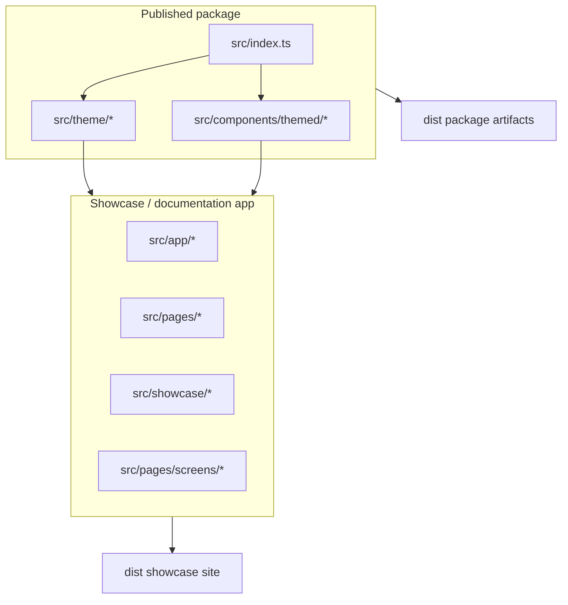
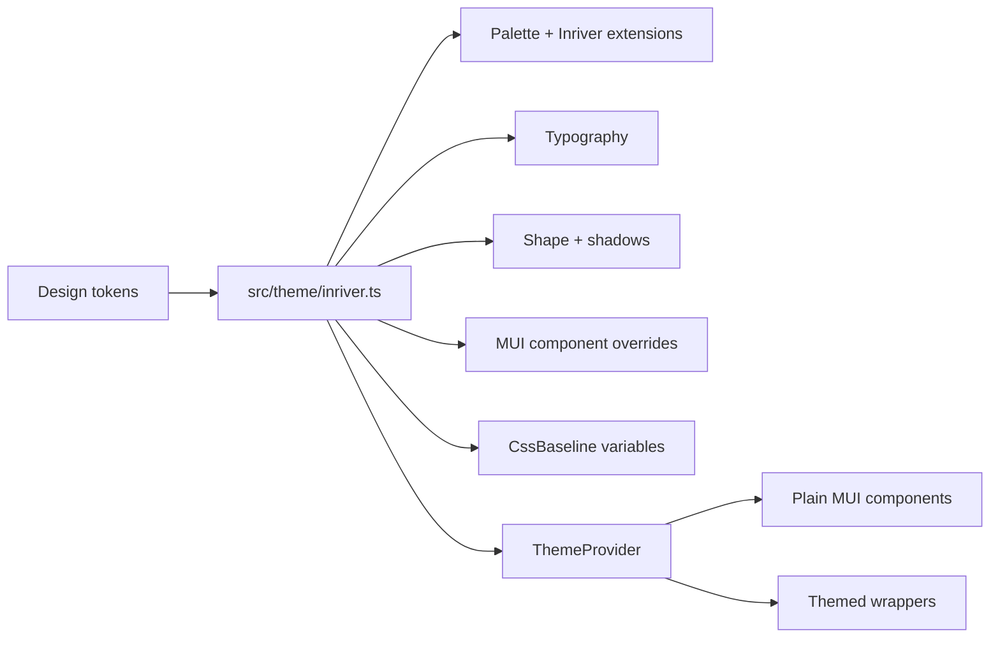
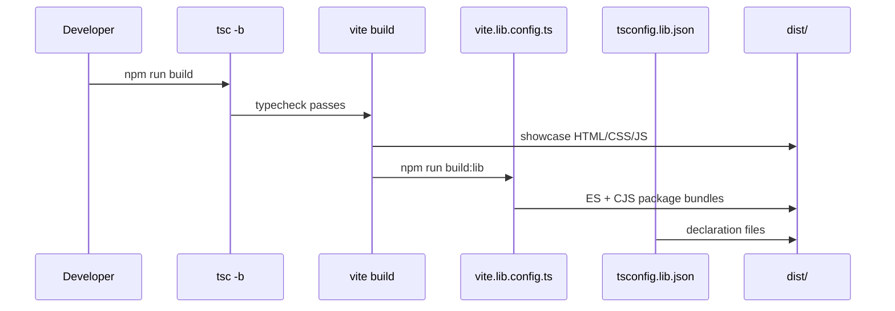

# Inriver React Theme Architecture

This repository has two jobs:

1. Build the importable `inriver-react-theme` package.
2. Host a live showcase so designers and developers can review the theme in context.

Those two jobs share code, but they are intentionally not the same public API.



## Package boundary

The public package entry is `src/index.ts`:

```ts
export * from './theme';
export * from './components/themed';
```

That means consumers get:

- `inriverTheme`
- `defaultTheme`
- `inriverTokens`, `inriverCustomColors`, `inriverSpacing`
- `ThemedButton`, `ThemedChip`, `ThemedTextField`, `ThemedCard`, `ThemedDialog`, `ThemedTable`

They should not import from `src/pages`, `src/showcase`, `src/app`, or individual source paths. The library build and declarations are limited by `tsconfig.lib.json` to the package boundary:

```text
src/index.ts
src/theme/**/*
src/components/themed/**/*
```

## Theme source of truth

`src/theme/inriver.ts` is the canonical theme definition. It owns:



- palette and Inriver-specific palette extensions;
- typography and font stack;
- spacing and shape defaults;
- elevation/shadow values;
- MUI component `defaultProps` and `styleOverrides`;
- CSS baseline variables used by themed surfaces.

Most visual consistency should be solved here first. If a style can be expressed as a global MUI default or override, prefer the theme over repeating `sx` in individual product apps.

## Token exports

`src/theme/tokens.ts` exports raw token constants. These are useful when:

- building a custom surface that is not a MUI component;
- sharing values outside `sx` or `styled()`;
- documenting exact design-system values.

Do not reach for tokens first when a normal MUI component under `ThemeProvider` can do the job. Theme-first keeps the design system easier to evolve.

## Themed wrappers

`src/components/themed/` contains small wrapper components around MUI primitives. They exist for repeated product patterns that need a stronger shared contract than global theme overrides alone.

Use wrapper components when:

- the same Inriver-specific component pattern appears in multiple apps;
- the component needs a simplified API, such as `ThemedTable` with `columns` and `data`;
- a local app would otherwise copy the same token-heavy `sx` block repeatedly.

Prefer plain MUI components when:

- the global theme already gives the expected look;
- the styling is one-off and local to one app;
- the wrapper would hide useful MUI behavior without adding an Inriver convention.

Wrapper components should preserve MUI ergonomics: forward refs, extend the relevant MUI prop type, and keep `sx` composable.

## Showcase app

The showcase app is the documentation and review surface. It is not the package API.

Important paths:

- `src/app/routes.tsx` - routes for `/`, `/components`, `/tokens`, `/guidelines`, and examples.
- `src/app/ThemeContext.tsx` - wraps the showcase with `ThemeProvider` and allows comparison with the default MUI theme.
- `src/showcase/categories.ts` - component catalog metadata.
- `src/showcase/demos/` - demo implementations for individual MUI components.
- `src/pages/GuidelinesPage.tsx` - live import/versioning guidance.

The showcase should demonstrate how consumers should use the theme, but demos can include explanatory code that should not be copied into production apps unchanged.

## Build flow

`npm run build` performs three related tasks:



1. TypeScript project build with `tsc -b`.
2. Showcase build with the normal Vite config.
3. Library build through `vite.lib.config.ts` plus declaration output from `tsconfig.lib.json`.

`vite.lib.config.ts` externalizes React, React DOM, MUI, and Emotion. This is intentional: consuming apps own those dependencies through peer dependencies, which avoids duplicate React trees and duplicate MUI style engines.

## Change workflow

For theme changes:

1. Start in `src/theme/inriver.ts`.
2. Add token exports only if non-MUI consumers need direct values.
3. Add a themed wrapper only for repeated cross-app patterns.
4. Update showcase demos or `/guidelines` when the intended usage changes.
5. Run `npm run build`.
6. Release through a compatibility checkpoint only after consuming apps validate the change.

## Stability rule

The stable API is the package root export, not the repository structure. Internal files may move as the showcase evolves. Consumers should depend on package exports and compatibility checkpoints, not on source paths or assumptions about the showcase app.
