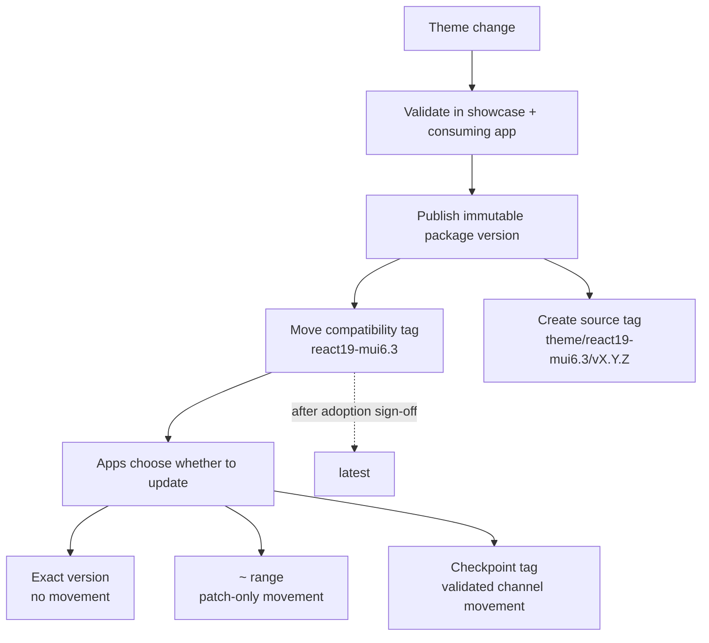
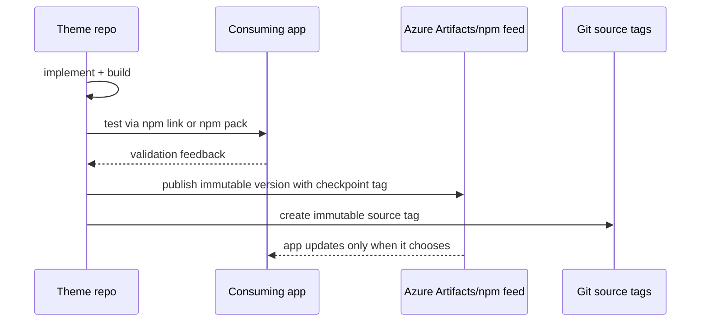

# Versioning and Fragmentation Strategy

The theme package needs to solve two problems at the same time:

1. Give teams one shared Inflow design system.
2. Avoid forcing every app onto unvalidated bleeding-edge changes.

The strategy is to publish immutable package versions and expose moving compatibility tags only after validation.



## Core model

| Concept | Example | Meaning |
| --- | --- | --- |
| Exact version | `@inriver/inflow@0.1.0` | A frozen package artifact. Once published, it does not change. |
| Patch range | `~0.1.0` | Accepts `0.1.x` fixes but blocks `0.2.0` and above. |
| Compatibility tag | `react19-mui6.3` | A moving channel for the same React/MUI baseline. |
| Source tag | `theme/react19-mui6.3/v0.1.0` | Immutable Git tag for the source that produced a package version. |
| `latest` | `@inriver/inflow@latest` | General default only after adoption verification. |

Published versions must be treated as immutable. If a release is wrong, publish a new patch version; do not try to replace the same version.

## Compatibility checkpoints

A checkpoint is the contract between the theme package and consuming apps. The current checkpoint is:

```text
React 19 / MUI 6.3
dist-tag: react19-mui6.3
peer range: @mui/material >=6.3.0 <6.4.0
```

The MUI range is intentionally narrow. If MUI 6.4 changes component behavior, that should be validated as a new checkpoint instead of silently affecting existing apps.

Examples of new checkpoints:

- `react19-mui6.4`
- `react20-mui7`

## What changes each version segment means

Because this package is still pre-1.0, be conservative: any consumer-visible change should be documented clearly. Once the package reaches 1.0, use this policy:

- **PATCH**: fixes inside the same checkpoint. Examples: accessibility fixes, corrected component spacing, bug fixes in wrapper components, documentation updates.
- **MINOR**: additive non-breaking work. Examples: new wrapper component, new token export, new examples, new optional props.
- **MAJOR**: breaking contract changes. Examples: removing exports, changing peer dependency baseline, changing component APIs, or broad visual changes that require app-level sign-off.

Checkpoint tags can move across patch versions, for example from `0.1.0` to `0.1.1`, but only after validation against consuming apps.

## Recommended dependency choices for apps

| App need | Dependency choice |
| --- | --- |
| Complete freeze | `@inriver/inflow@0.1.0` |
| Safe patch updates only | `~0.1.0` |
| Follow validated React/MUI checkpoint | `@inriver/inflow@react19-mui6.3` |
| Evaluate upcoming baseline | `@inriver/inflow@next` or a prerelease package |
| Local theme iteration | `npm link @inriver/inflow` |

Avoid `^` for apps that must not pick up a new compatibility checkpoint automatically.

## Release workflow

1. Make the theme change.
2. Run local showcase QA.
3. Test through `npm link` or `npm pack` in at least one consuming app.
4. Update docs and examples if usage changed.
5. Bump the package version.
6. Build the package.
7. Publish with an approved checkpoint tag.
8. Add an immutable source tag.
9. Promote to `latest` only after adoption verification.



```bash
npm version patch
npm run build
INFLOW_THEME_RELEASE_TAG=react19-mui6.3 npm publish --tag react19-mui6.3

git tag -a theme/react19-mui6.3/v0.1.1 -m "@inriver/inflow 0.1.1 - React 19 / MUI 6.3"
git push origin theme/react19-mui6.3/v0.1.1
```

Promote only after teams agree the checkpoint is safe as the default:

```bash
npm dist-tag add @inriver/inflow@0.1.1 latest
```

## Local development is not a release channel

Use `npm link` when a developer is actively changing the theme and testing it in another local app.

```bash
# in @inriver/inflow
npm install
npm run build
npm link

# in the consuming app
npm link @inriver/inflow
npm ls react
```

Before merging or publishing, test the packed or published artifact as well. Linked packages can hide packaging mistakes and can expose duplicate React problems if peer dependencies are not respected.

## Backport policy

Do not create long-lived bespoke theme branches for every app. That creates the fragmentation this repo is meant to prevent.

- Normal fixes go into the current supported checkpoint.
- Apps on older checkpoints should migrate forward when possible.
- Local wrappers are acceptable for app-specific visual needs.
- Emergency backports require team approval and should be rare.

## Governance principles

- One canonical theme source: `src/theme/inflow.ts`.
- One public package boundary: `src/index.ts`.
- Immutable package versions for auditability.
- Moving checkpoint tags for validated patch flow.
- No direct publish to `latest`.
- No consuming app should depend on unversioned source files or showcase internals.
