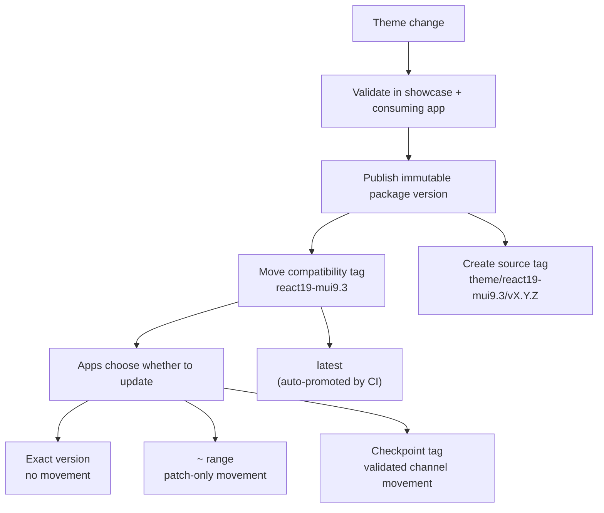
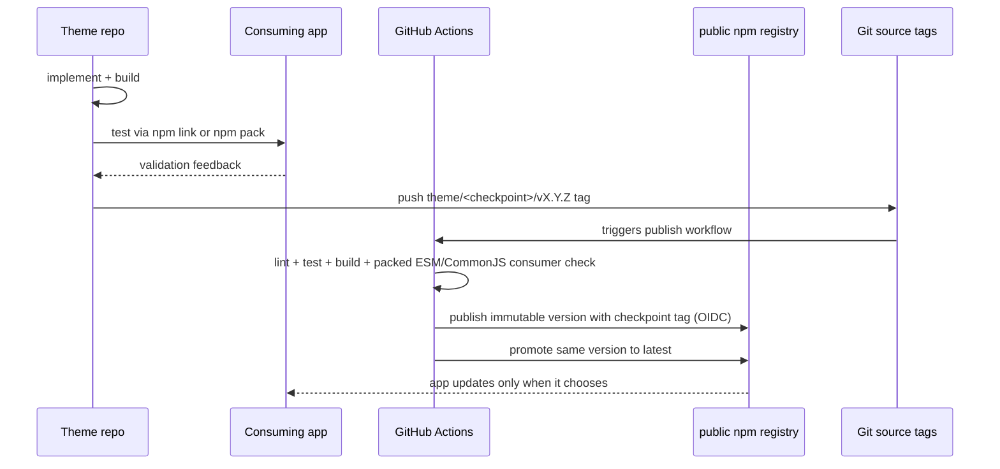

# Versioning and Fragmentation Strategy

The theme package needs to solve two problems at the same time:

1. Give teams one shared Inflow design system.
2. Avoid forcing every app onto unvalidated bleeding-edge changes.

The strategy is to publish immutable package versions and expose moving compatibility tags only after validation.



## Core model

| Concept | Example | Meaning |
| --- | --- | --- |
| Exact version | `@inriver/inflow-react@3.5.0` | A frozen package artifact. Once published, it does not change. |
| Patch range | `~3.5.0` | Accepts `3.5.x` fixes but blocks `3.6.0` and above. |
| Compatibility tag | `react19-mui9.3` | A moving channel for the same React/MUI baseline. |
| Source tag | `theme/react19-mui9.3/v3.5.0` | Immutable Git tag for the source that produced a package version. |
| `latest` | `@inriver/inflow-react@latest` | Automatically promoted by CI immediately after every checkpoint-tag publish (see `.github/workflows/publish.yml`). Apps that want a validated, deliberately-adopted version should pin an exact version or a checkpoint tag instead of relying on `latest`. |

Published versions must be treated as immutable. If a release is wrong, publish a new patch version; do not try to replace the same version.

## Compatibility checkpoints

A checkpoint is the contract between the theme package and consuming apps. The
current compatibility target is:

```text
React 19 / MUI 9.3
dist-tag: react19-mui9.3
peer range: @mui/material >=9.0.0 <10.0.0
```

Previous checkpoint (still available for apps on MUI 7):

```text
React 19 / MUI 7.3
dist-tag: react19-mui7.3
peer range: @mui/material >=7.0.0 <8.0.0
```

The MUI range is intentionally narrow. If a MUI minor or major changes component behavior, that should be validated as a new checkpoint instead of silently affecting existing apps.

Examples of checkpoints:

- `react19-mui7.3` (previous, MUI 7)
- `react19-mui9.3` (current, MUI 9.3)
- `react20-mui9.3` (future example)

## Beta maturity and Semantic Versioning

The project is **Beta**. Beta describes the maturity of the project and its
release confidence; it does not create an npm prerelease version or a separate
`beta` dist-tag. The npm registry is authoritative for published versions and
dist-tags.

Public APIs follow Semantic Versioning now:

- **PATCH**: fixes inside the same checkpoint. Examples: accessibility fixes, corrected component spacing, bug fixes in wrapper components, documentation updates.
- **MINOR**: additive non-breaking work. Examples: new wrapper component, new token export, new examples, new optional props.
- **MAJOR**: breaking contract changes. Examples: removing exports, changing peer dependency baseline, changing component APIs, or broad visual changes that require app-level sign-off.

Checkpoint tags can move across patch versions, for example from `3.5.0` to `3.5.1`, but only after validation against consuming apps.

## Recommended dependency choices for apps

| App need | Dependency choice |
| --- | --- |
| Complete freeze | `@inriver/inflow-react@3.5.0` |
| Safe patch updates only | `~3.5.0` |
| Follow a validated React/MUI checkpoint | `@inriver/inflow-react@react19-mui9.3` (current) or `@inriver/inflow-react@react19-mui7.3` (MUI 7) |
| Evaluate an unreleased change | Install a local packed artifact; there is no separate npm prerelease channel. |
| Local theme iteration | `npm link @inriver/inflow-react` |

Avoid `^` for apps that must not pick up a new compatibility checkpoint automatically.

## Release workflow

1. Make the theme change.
2. Run local showcase QA.
3. Run `npm run test:pack` to test the tarball in an isolated consumer. It
   verifies ESM and CommonJS imports, server rendering, AG Grid, and the
   package boundary; `npm link` remains useful for local iteration.
4. Update docs and examples if usage changed.
5. Bump the package version.
6. Push a `theme/<checkpoint>/vX.Y.Z` git tag (e.g. `theme/react19-mui9.3/v3.5.0`) only after the version is ready to release.
7. CI (`.github/workflows/publish.yml`) takes it from there: lint, test,
   build, `npm run test:pack`, publish with the checkpoint tag via npm Trusted
   Publishing (OIDC, no stored tokens), then automatically promotes that same
   version to `latest`.



Public npm is the primary consumer registry for `@inriver/inflow-react`. Internal source control or CI can still live in Azure DevOps or other private infrastructure without changing the release-channel model.

```bash
npm version patch
VERSION="$(node -p "require('./package.json').version")"
git push origin master
git tag -a "theme/react19-mui9.3/v$VERSION" -m "@inriver/inflow-react $VERSION - React 19 / MUI 9.3"
git push origin "theme/react19-mui9.3/v$VERSION"
```

Pushing that tag is the entire release step — CI lints, tests, builds, publishes under the checkpoint tag, and promotes to `latest` automatically. There is no separate manual `npm publish` or `npm dist-tag add` step for ordinary releases; run those manually only when recovering from a failed/partial CI run.

## Local development is not a release channel

Use `npm link` when a developer is actively changing the theme and testing it in another local app.

```bash
# in @inriver/inflow-react
npm install
npm run build
npm link

# in the consuming app
npm link @inriver/inflow-react
npm ls react
```

Before merging or publishing, run `npm run test:pack` against the packed
artifact. Linked packages can hide packaging mistakes and can expose duplicate
React problems if peer dependencies are not respected.

## Backport policy

Do not create long-lived bespoke theme branches for every app. That creates the fragmentation this repo is meant to prevent.

- Normal fixes go into the current supported checkpoint.
- Apps on older checkpoints should migrate forward when possible.
- Local wrappers are acceptable for app-specific visual needs.
- Emergency backports require team approval and should be rare.

## Governance principles

- One canonical theme source: `src/theme/inflow.ts`.
- One public package boundary: `src/index.ts`.
- Immutable package versions for auditability.
- Moving checkpoint tags for validated patch flow.
- No direct `npm publish --tag latest` (`guard-publish.cjs` blocks it) - every release publishes under a checkpoint tag first. `latest` itself is then auto-promoted by CI to match the newest checkpoint publish immediately, with no adoption-verification gate. Apps that need a deliberately-adopted version should pin an exact version or a checkpoint tag rather than depending on `latest`.
- No consuming app should depend on unversioned source files or showcase internals.
